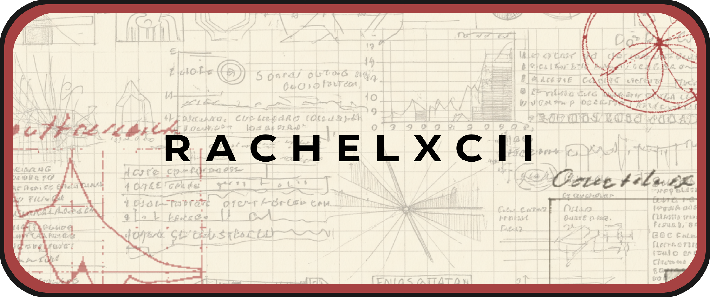

<h1 align="center">Social Networks</h1>

    <a href="https://www.datacamp.com/portfolio/Rachelxcii">
    <a href="https://www.hackerrank.com/rachelxcii">
    <a href="https://leetcode.com/Rachelxcii/">
    <a href="https://www.linkedin.com/in/rachelxcii/">
    <a href="https://github.com/Rachelxcii/Rachelxcii/wiki">
    

---
# Tasks to improve skills:
          
   - [x] [Google IT Automation with Python](https://www.coursera.org/professional-certificates/google-it-automation), specialization program of Google.
   - [ ] Course [IBM Data Science](https://www.coursera.org/professional-certificates/ibm-data-science), specialization program of IBM.
   - [ ] Course [Machine Learning](https://www.coursera.org/learn/machine-learning), Stanford University.
   - [ ] Course [Deep Learning](https://www.coursera.org/specializations/deep-learning), DeepLearning.AI.
   - [ ] Do testing environment for each code upload in my github.
   - [ ] Developing an algorithm for active galaxies classification.
 
---
# Short story about me

### I'm a Naval Engineer from Polytechnic University of Madrid, I also studied a Master in Astronomy and Astrophysics, while studying both masters and working as an intern, I started coding and, in that moment, I discovered the love of my life.

### I started with Matlab and Arduino, and later I coded using Python. I decided to apply my coding knowledges to my final project of Master in Astronomy and Astrophysics, its title was "Machine Learning Techniques for Classification of Active Galaxies".

### After finishing both careers, I've redirected all my efforts to improve my coding skills and knowledges. I hope one day to work on it as a job. Until then I will include some of my projects in this github.

---

    

