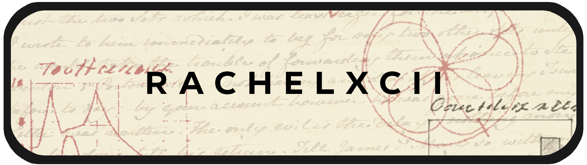

<h1 align="center">Professional Ecosystem</h1>

    
    <!--  -->
	
    
    <!--  -->
    <!--  -->

---

Greetings! I am Rachel. It is an honor to cross paths on this day.

I am a Naval Engineer and Astrophysicist. My journey with data began a few years ago during my Master’s in Astrophysics. I fell in love with it while classifying active galaxies using Machine Learning techniques.

Like Thomas Edison, I discovered a few methods that didn't classify galaxies correctly. However, that methodology and the precision of my analysis were rewarded with the highest grade: a 10 out of 10 on my thesis.

Leveraging Python and technical rigor, I’ve built a solid foundation as a Data Quality Analyst, while occasionally collaborating on Data Engineering tasks. Currently, I focus on bridging Data Analytics with AI Engineering, exploring agentic programming to build autonomous and high-impact data solutions.

**Core Competencies:**
- AI & Agentic Engineering: Designing autonomous workflows and intelligent architectures.
- Data Analytics & Statistics: Transforming complex datasets into actionable, high-precision insights.
- Data Quality: Ensuring high-stakes data is trustworthy, structured, and "production-ready".
- Python and SQL Mastery: My primary tools for solving complex technical puzzles.

**Beyond the Data:**
- I love precision and critical thinking: Good debates are my fuel.
- Storytelling is my passion: I am a Dungeon Master, which allows me to merge my global vision with narrative.
- Unafraid of error: I firmly believe that more is learned from how not to do things than from easy success.

Explore my repositories to see my work in action. May your dice (and your data) always roll high!

<!-- , or find me at the "Great Library of YouTube" where I share technical knowledge.-->

---

    

